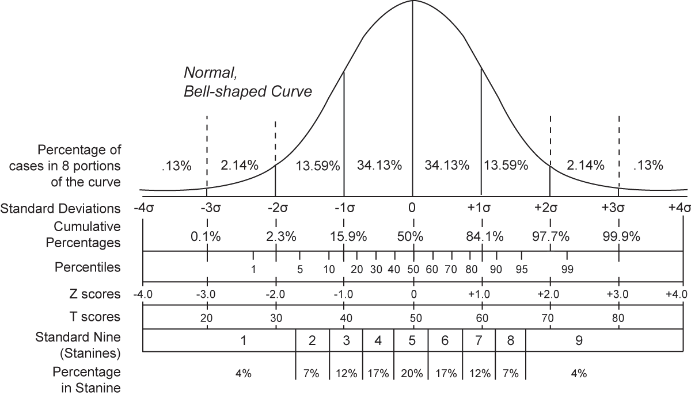

# Data Analysis

- 원시(원본 그대로) 데이터를 분석하여 인사이트(가시성 증가 및 깊은 이해)로 변환하는 작업이다.
- 문제를 해결하기 위해 데이터를 사용해서 흐름 및 방향을 찾는 기술이다.
- 데이터 분석을 통해 비지니스 프로세스를 구성하고, 의사 결정을 개선하며, 비지니스 성장을 증진할 수 있다.

ETL은 Extract(추출), Transform(변환), Load(적재)를 의미한다. 여기저기 흩어진 데이터를 하나로 모으기 위한 결합 과정이다.px;">

## 기초 통계 (Basic statistics)

📌 통계는 아직 발생하지 않은 일을 예측하기 위해 사용한다.

- 통계학을 공부하는데 있어 필요한 기본 개념이고,  
  수량적인 비교를 기포로 많은 사실을 관찰하고 처리하는 방법을 연구하는 학문이다.
- 불균형 데이터를 대상으로 규칙성과 불규칙성을 발견한 뒤 실생활에 적용할 수있다.
  

#### 변량 (Variable)

- 자료의 수치를 변량이라고 하며, 이는 데이터의 값을 의미한다.

#### 계급 (Class)

- 변량을 일정 간격으로 나눈 구간을 의미한다.
- 변량의 최소값과 최대값을 잘 고려해서 계급을 정해야한다.
- 예를 들어, 150 ~ 160 계급이 있을 경우, 160까지 속한다. 즉 151~ 160까지이다.

#### 도수 (Frequency)

- 각 계급에 속하는 변량의 개수를 의미한다.

#### 상대 도수 (Relative frequency)

- 각 계급에 속하는 변량의 비율을 의미한다.

#### 도수 분포표(Frequency table)

- 주어진 자료를 계급별로 나눈 뒤 각 계급에 속하는 도수 및 상대 도수를 조사한 표이다.
- 구간별 분포를 한번에 알아보기 좋지만 계급별 각 변량의 정확한 값이 생략되어 있다.

#### 히스토그램 (Histogram)

- 도수 분포표를 시각화한 그래프이다.

#### 산술평균 (Mean)

- 변량의 합을 변량의 수로 나눈 값을 의미한다.

#### 편차 (Deviation)

- 변량에서 평균을 뺀 값이다.
- 각 변량의 편차를 구한뒤 모두 합하면 0이 되기 때문에 편차의 평균을 구할 수 없다.

#### 분산 (Variance)

- 변량이 평균으로부터 떨어져 있는 정도를 보기 위한 통계량이다.
- 편차에 제곱하여 그 합을 구한 뒤 산술 평균을 낸다.

#### 표준편차 (Standard deviation)

- 분산의 제곱근이며, 관측된 변량의 흩어진 정도를 하나의 수치로 나타내는 통계량이다.
- 표준편차가 작을 수록 평균 값에서 변량들의 거리가 가깝다고 판단한다.

#### 확률변수 (Random variable)

- 머신러닝, 딥러닝 등 확률을 다루는 분야에 있어서 필수적인 개념이다.
- 확률(probability)이 있다는 뜻은 사건(event)이 있다는 뜻이며, 시행(trial)을 해야 시행의 결과인 사건(event)이 나타난다.
- 시행(trial)을 해서 어떤 사건(event)이 나타났는지에 따라 값이 정해지는 변수이다.
- 알파벳 대문자로 표현하며, X, Y, Z 또는 X1 X2 X3과 같이 표현한다.
- 학률 변수는 집합이며, 원소를 확률변수값(Value of random variable)이라고 표현한다. 확률변수에서 사용한 알파벳의 소문자를 사용한다.
- Y = {y1, y2, y<sub31}, 이 때 Y는 확률변수이고 원소인 y1 ~ y3은 확률변수값이다.

#### 범주형 확률변수 (Categorical random variable)

- 범주형 확률변수값은 수치가 아닌 기호나 언어, 숫자등으로 표현하고, 기호나 언어는 순서를 가질 수도 있다.
- 유한집합으로 표현한다. 유한집합은 원소의 수가 유한한 집합을 의미한다.
- {앞면, 뒷면}, {동의, 비동의}, {선택, 미선택}, {봄, 여름, 가을, 겨울}

#### 이산형 확률변수 (Discrete random variable)

- 이산형 확률변수값은 수치로 표현하고 셀 수 있는 값이다. 이를 더 넓은 범위로, 양적 확률 변수 또는 수치형 확률 변수라고도 한다.
- 유한 집합 또는 셀 수 있는 무한 집합으로 표현한다. 무한 집합은 원소의 수가 무한한 집합을 의미한다.
- {0, 1, 2, 3}, {10, 20, 30}, {1, 2, 3, ...}, {100, 1000, 10000}

#### 연속형 확률변수 (Continuous random variable)

- 연속형 확률 변수는 구간을 나타내는 수치로 표현한다. 이를 더 없은 범위로, 양적 확률 변수 또는 수피형 확률 변수라고도 부른다.
- 셀 수 없는 무한집합으로 표현한다.
- 128.56 < X < 268.56

#### 확률분포 (Probability distribution)

- 사건에 대한 확률 변수에서 정의된 모든 확률 값의 분포이며 서로 다른 모든 결과의 출현 확률을 제공한다.
  > <strong>1) 동전 던지기(시행)</strong>  
  > <strong>2) { 0, 1 } (확률변수와 학률변수값)</strong>  
  > <strong>3) 완벽한 형태의 동전일 경우 확률 분포</strong>
  >
  > 
  >  
  > <strong>1) 1 ~ 12까지 새겨진 주사위 던지기(시행)</strong>  
  > <strong>2) { 1, 2, 3, 4, 5, 6, 7, 8, 9, 10, 11, 12 } (확률변수와 학률변수값)</strong>  
  > <strong>3) 완벽한 형태의 주사위일 경우 확률 분포</strong>
  >
  > 

#### 확률분포표 (Probability distribution table)

- 확률변수의 모든 값(원소)에 대해 확률을 표로 표시한 것이다.
- 범주형 또는 이산형 확률 변수의 확률 분포를 표현하기에 적합한 방식이다.

#### 확률분포함수 (Probability distribution funtion)

- 확률변수의 분포를 나타내는 함수로서, 확률변수의 확률변수값이 나올 확률을 나타내는 함수이다.
- 확률질량함수, 확률밀도함수 등의 함수가 있다.

#### 확률질량 함수 (Probability mass function, pmf)

- 확률변수 X의 분포를 나타내는 함수로서, xi가 나올 확률이다.
- 확률 변수의 값을 매개변수로 전달 받고, 해당 값이 나타날 확률을 구해서 리턴하는 함수이다.
- 범주형 확률변수와 이산형 확률 변수에서 사용된다.
- 확률변수에서 각 값에 대한 확률을 나타내는 것이 마치 각 값이 "질량"을 가지고 있는 것처럼 보이기 때문에 확률 질량 함수로 불린다.

> 확률질량 함수 f는 확률변수 X가 변수값으로 가질때의 확률이다.  
>   
>   
> 

#### 무한대 (Infinity)

- 끝없이 커지는 상태를 의미하고 기호로 ∞를 사용한다.

#### 무한소 (Infinitesimal)

- 거의 없다는 의미이고, 0에 매우 근접하지만 0이 아닌 상태를 의미한다.

#### 미분 (Differential)

- 기울기는 독립변수가 종속 변수에 미치는 영향력의 크기를 의미한다.
- 변경 전의 독립변수 x1 이라는 점과 변경 후의 x2라는 점을 지나는 직선의 기울기가 바로 변화에 대한 속도이다.
- 즉 , 직선의 기울기가 4로 구해졌다면, 종속변수가 독립변수의 변화에 4배 속도로 변화된 것이다.
- 이 때, 두점 사이가 무한히 가까워지면, 결국 거의 한점과 같은 점에 대한 접선의 기울기가 되고 이는 순간적인 변화량이다.
- 미분을 통해서 독립변수가 굉장히 미세하게 변화할 때 순간적으로 종속 변수가 얼마나 빠르게 변화하는 지를 알수 있다.

#### 적분 (Integral)

- 선분 = 높이(길이), 면적 = 가로 X 높이
- 면적을 구할 때 여러 사각형으로 나눈 뒤 합하여도 전체 면적이 나온다.
- 가로가 무한소 0인 사각형 즉, 선분과 비슷한 사각형을 쌓은 뒤, 각 면적을 모두 합하는 것이 적분이다.

#### 확률밀도 함수 (Probability density function, pdf)

- 확률 변수 X의 분포를 나타내는 함수로서, 특정 구간에 속할 확률이고 이는 특정 구간을 적분한 값이다.
- 확률변수값의 범위(구간)를 매개변수로 전달받고, 범위의 넓이는 구해서 리턴하는 함수이다.
- 연속형 확률변수에서 사용된다.
- 전체에 대한 확률이 아닌 구간에 포함될 확률을 나타내기 때문에구간에 다른 밀도를 구하는 것이고, 이를 통해 확률밀도 함수라 불린다.

> 확률 밀도 함수 f는 특정 구간에 포함될 확률을 나타낸다.  
>   
>   
>   
> 

#### 정규분포 (Normal distribution)

- 모든 독립적인 확률변수들의 평균은 어떠한 분포에 가까워지는데, 이 분포를 정규분포라고 한다.
- 즉, 비 정규분포의 대부분은 극한 상태에서 있어서 정규분포에 가까워진다.

 

- 평균 μ(mu)와 표준편차 σ(sigma)에 대해 아래의 확률밀도함수를 가지는 분포를 의미한다.

    

  
    

#### 표준 정규분포 (Standard mormal distribution)

- 정규분포는 평균과 표준편자에 따라서 모양이 달라진다.

- 정규분포를 따르는 분포는 많지만 각 평균과 표준편차가 달라서 일반화 할 수 없다.
- N(μ, σ) = N(0, 1)로 만든다면 모두 같은 특성을 가지는 동일한 확률 분포로 바꿔서 일반화할 수 있다.
- 따라서 일반 정규분포로 바군 뒤 표준 정규분포의 특정 구간의 넓이를 이용해서 원래 분포의 확률을 구할 수 있다.

#### 표준화 (Standardiztion)

- 다양한 형태의 정규분포를 표준 정규분포로 변환하는 방법이다.
- 표준 정규분포에 대한 값(넓이)를 이용해 원래 분포의 확률을 구할 수 있다.

#### 모집단과 모수 (Population and population parameter)

- 모집단이란, 정보를 얻고자 하는 대상의 전체 집합을 의미한다.
- 모수란, 모집단의 수치적 요약값을 의미한다. 평균 또는 표준편차와 같은 모집단의 통계값을 모수하고 한다.

#### 표본과 샘플링 (Sample and Sampling)

- 표본이란, 모집단의 부분 집합으로서 표본의 통계량을 통해 모집단의 통계량을 추론할 수 있다.
- 모집단의 통계량을 구할 수 없는 상황 즉, 전수 조사가 불가능한 상황에서 임의의 표본을 추출하여 분석한다.
- 이렇게 표본(sample)을 추출하는 작업을 샘플링(sampling)이라고 한다.

### 데이터 분석의 범위

#### 기술 통계 (Descriptive Statistics)

- 수집한 데이터의 요약을 통해서 데이터를 설명(묘사)하는 기법이다.
- 수집한 데이터의 전체적인 묘양을 그리기 위해 기술 통계 기법을 사용한다.
- 집중화 경향(Central tendency): 평균(Mean), 중앙값(Median), 최빈값(Mode)
- 분산도(Variation): 표준편차(Stantdard deviation), 사분위(Quartile)

#### 추론 통계 (Inferential Statistics)

- 수집한 데이터를 기반으로 특성(패턴)을 알아낸뒤 특정 데이터를 추론하거나 예측하는 기법이다.
- 모집단(Population)에서 일정 표본(Sample)을 채취한 뒤 ,표본에 대한 통계를 구하여 모집단에 대해 추론한다. 이를 통해 결론에 도달하는 기법이다.
- 데이터 전체를 조사할 수 없을때, 랜덤한 표본을 분석해서 나온 결과를 전체적으로 일반화 시킬 때 유용하다.

## Numpy

- 머신러닝 애플리케이션에서 데이터 추출, 가공, 변환 같은 데이터 처리 부분을 담당한다.
- 넘파이 기반의 사이킷런을 이해하기 위해서는 넘파이는 필수이다.
- 사이킷런은 직돤적이고 간결하기 때문에 상대적으로 개발하기 쉽지만 넘파이는 양도 많고 배울 것도 많다.
- 넘파이 전체를 다 이해하고 공부하는 것은 머신러닝을 포기하게 만들기 때문에 기본 문법과 중요 API만 이해하는 전략으로 좋다.

#### ndarray

- N 차원(n-dimension)배열 객체이다.
- 파이선 list를 array()메서드에 전달하면 ndarray로 변환되고 넘파이의 다양한 편리한 기능을 사용할 수 있게 된다.
- 반드시 같은 자료형 데이터만 담아야한다.

#### astype()

- ndarray에 저장된 요소의 타입을 변환 시킬 때 사용한다.
- 대용량 데이터 처리시, 메모리 절약을 위해 사용한다.

#### axis

- 축의 방향성을 표혆라 때 axis로 표현할 수 있다.

#### arange(), zeros(), ones()

- ndarray의 요소를 원하는 범위의 연속값, 0 또는 1로 초기화할 때 사용한다.

### reshape()

- ndarray의 기존 shape를 다른 shape로 변경한다.

#### Indexing

- 특정 위치의 데이터를 가져오는 것
- 위치 인덱싱(Location indexing)
- 슬라이싱(Slicing)
- 팬시 인덱싱(Fancy indexing)
- 불린 인덱싱(Boolean indexing)

#### Sorting

- 모두 오름차순 정렬이며, 내림차순은 오름차순 정렬 후 [::-1]을 붙여 사용한다.

## 판다스 (Pasdas)
- 데이터 처리 라이브러리 중 가장 인기있는 라이브러리이다.
- 2차원 데이터(테이블, 엑셀, CSV 등)를 효율적으로 가공 및 처리할 수 있다.

#### 판다스 구성 요소
- DataFrame: 행과 열로 구성괸 2차원 Dataset을 의미한다.
- Series: 1개의 열로만 구성된 열벡터 Dataset을 의미한다.
- Index: DataFrame과 Series에서 중복없는 행 번호를 의미한다.

#### DataFrame()
- dict를 DataFrame으로 변환하고자 할 때 DataFrame 생서앚에 전달한다.
- 컬럼며을 추가하거나 인덱스명을 변경하는 등 다양하게 설정할 수 있다.

#### read_csv()
- csv 파일을 DataFrame으로 읽어온다.

#### head()
- 전체 데이터 중 앞부분 일부를 가져온다.

#### tail()
- 전체 데이터 중 일부를 가져온다.

#### iloc[], loc[]
- 원하는 행 도는 열을 가져온다.
- iloc은 인덱스 번호를 가져오고, loc은 인덱스 값 또는 컬럼명으로 가져온다.

#### describe()
- 숫자형 데이터의 개수, 평균, 표준편차, 최소값, 사분위 분포도(중앙값: 50%), 최대값을 제공한다.
- 25번째 백분위수와 75번째 백분위수를 기준으로 정상치의 범위를 설정할 수 있다.

#### 결속 데이터 처리하기
- isna()를 통해 결속 데이터 여부를 확인할 수 있다.
- fillna()를 통해 결속 데이터를 다른 값으로 대체할 수 있다.